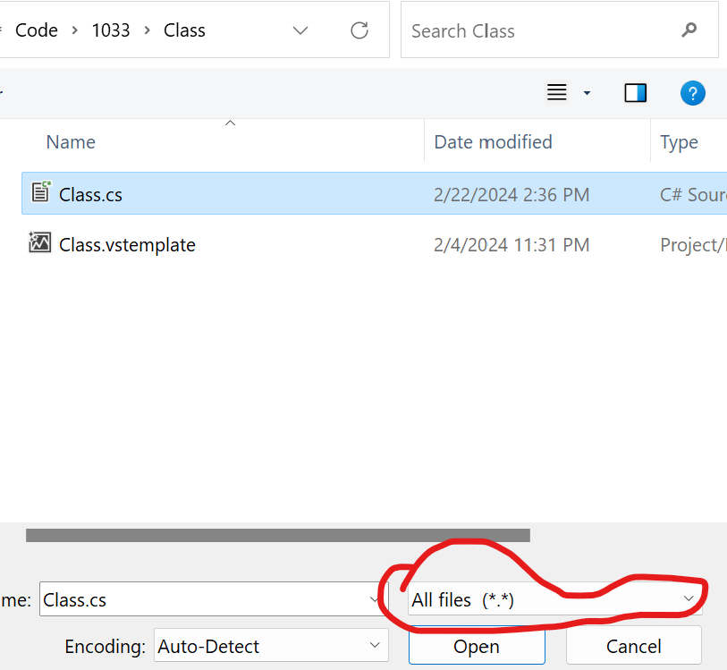
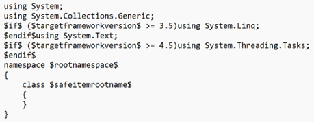
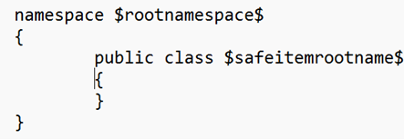
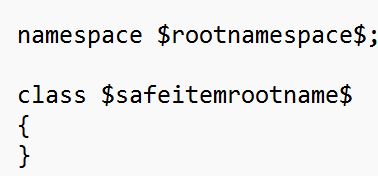
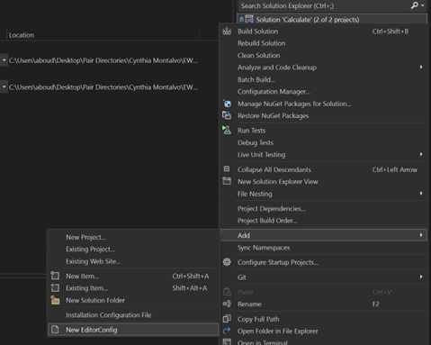
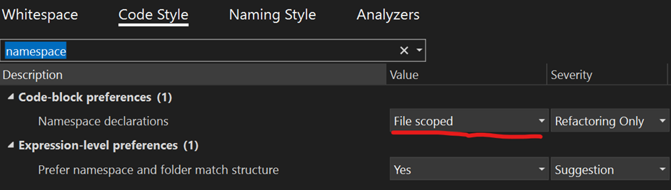

# Customizing Visual Studio Templates and Editor Configuration

## Modifying Default Class Template

### Navigate to Template Location:

1. **Path**: `C:\Program Files\Microsoft Visual Studio\2022\Preview\Common7\IDE\ItemTemplates\CSharp\Code\1033\Class\Class.cs`
   *(Note: Your path may vary depending on your Visual Studio version)*

### Open with Notepad as Administrator:

1. Right-click on `Class.cs`, select "Copy path", then press the Windows key, search for Notepad, right-click, and choose "Run as administrator".
2. Go to `File` > `Open`, paste the path, or navigate to it manually. Change the file search type to `All Files (*.*)`.
   

### Edit Class.cs:
1. From this

// Removed using statements per Marks recommendation

3. To this:
   

    
   

   
## Changing Namespace Curly Brace Behavior

Adjust the default namespace curly brace behavior using either of the following methods:

### Method 1: Directly in Class Template:

  Path: C:\Program Files\Microsoft Visual Studio\2022\Preview\Common7\IDE\ItemTemplates\CSharp\Code\1033\Class\Class.cs
    Edit the file:
        Remove the curly braces.
        Add a semicolon.
        Unindent the class to be inline with namespace.
        
  
  Save by pressing CTRL + S.

### Method 2: Using .editorconfig File(Better method imo):

  Generate .editorconfig file if not present.

  
  
  Navigate to Solution Items in Visual Studio
  
  1. Double click .editorconfig.
  2. Go to the CodeStyle section, and search for Namespace.
  3. Under Code block preferences, find Namespace declarations and change from Block Scoped to File Scoped.
  4. 
  5. Save the file with CTRL + S.

Implementing these changes will help you have consistency to your coding experience and across your project. Make sure your partner adopts the changes by updating their class template.
Note: if you implement the namespace file scope through the .editorconfig this will be project wide and will be applicable to your partner aswell.

