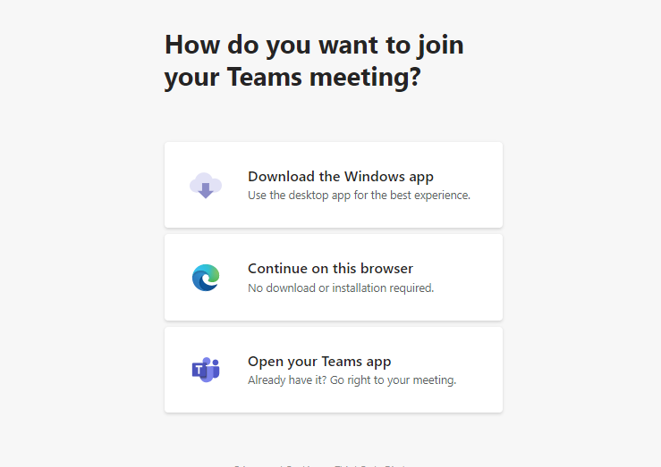
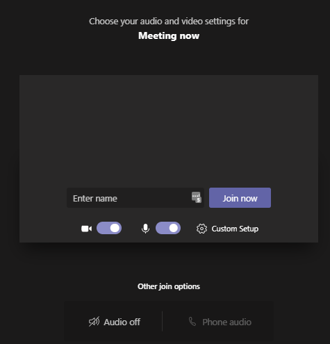
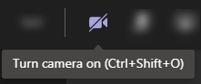

# Microsoft Teams guidelines #

Please do not share the [meeting link](https://teams.microsoft.com/l/meetup-join/19%3ameeting_MDFjNTliMWMtNTM2ZS00ODFkLWI3MzUtNTYwZDViNDhhOTRk%40thread.v2/0?context=%7b%22Tid%22%3a%2237321907-14a5-4390-987d-ec0c66c655cd%22%2c%22Oid%22%3a%22c97a0714-cc64-4648-8c15-d3dfd0818331%22%7d) with other outside of the class.

When you first click on the Team's meeting link you will see an option like this. Though the web browser will work fine, it is recommended to download the Microsoft Team's app.

Depending on whether you join in the browser or the app you will see a screen similar to the following:

.

## In the meeting ##

Though not required, when possible we do encourage people to turn on their web cams so we can get to know you.

When not speaking please keep your microphone muted to avoid any outside noise distractions. 
If you have questions please feel free to unmute and ask, or simply use the "raise hand" feature.
There is also a side chat that you are welcome to use.
